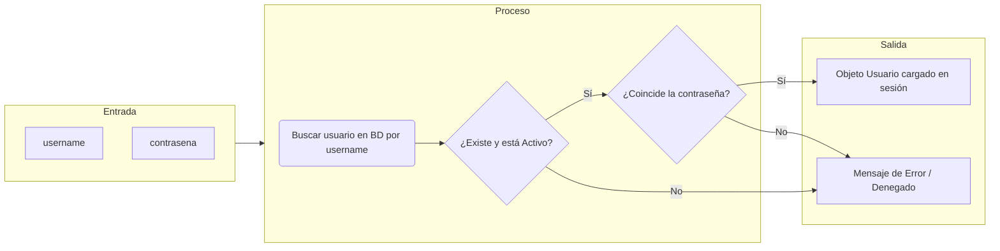
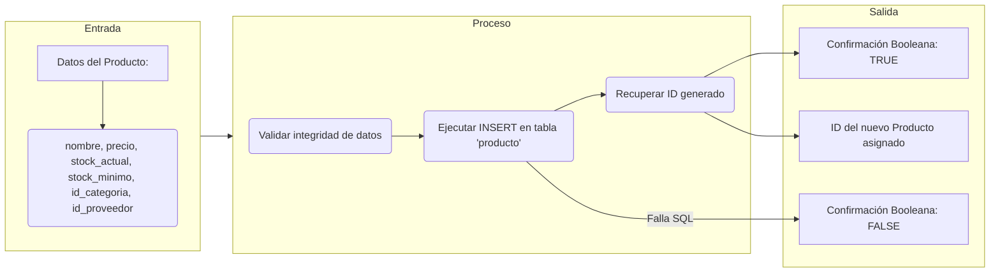
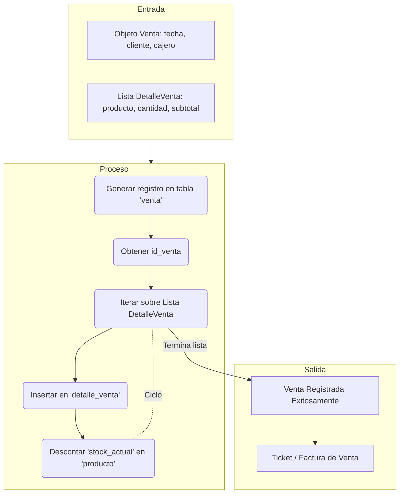
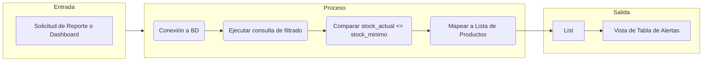
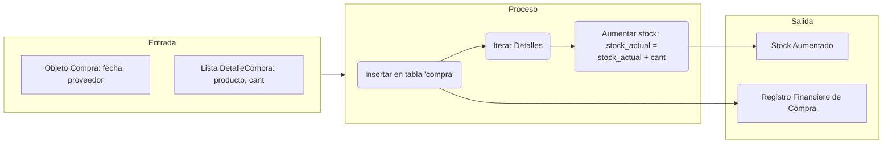
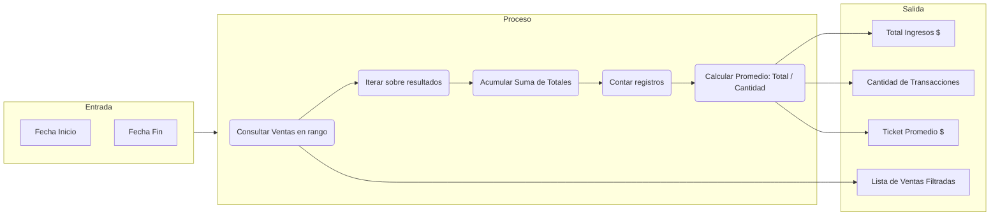

# SCE2.1 – Diagramas de Entrada, Proceso y Salida (IPO)

A continuación, se presentan los diagramas IPO (Input - Process - Output) de los métodos más críticos y representativos del sistema **SIGEV**, identificando claramente el flujo de datos.

---

## 1. Método: Autenticación de Usuario (Login)
**Clase / Método:** `UsuarioDAO.buscarPorUsername(String username)` y validación en Controlador.
**Descripción:** Verifica las credenciales de un usuario para permitir o denegar el acceso al sistema.

### Tabla Resumen
| Componente | Detalles |
| :--- | :--- |
| **Entradas** | `String username`, `String contrasena` |
| **Proceso** | 1. Recibir credenciales. 2. Ejecutar `SELECT * FROM usuario WHERE username = ? AND activo = TRUE`. 3. Comparar contraseña ingresada con la almacenada. |
| **Salidas** | **Éxito:** Objeto `Usuario` con sus datos y Rol. **Fallo:** Retorna `null` o falso (Error de credenciales). |

---

## 2. Método: Registrar Nuevo Producto
**Clase / Método:** `ProductoDAO.insertar(Producto p)`
**Descripción:** Añade un nuevo ítem de inventario a la base de datos maestra.

### Tabla Resumen
| Componente | Detalles |
| :--- | :--- |
| **Entradas** | Objeto `Producto` instanciado desde el formulario (CompraPanel / ProductoPanel). |
| **Proceso** | 1. Preparar sentencia SQL `INSERT`. 2. Inyectar parámetros en el `PreparedStatement`. 3. Ejecutar actualización y solicitar `Statement.RETURN_GENERATED_KEYS`. |
| **Salidas** | `boolean true` si se registró correctamente, asignando el nuevo ID al objeto original. `boolean false` si hubo error SQL. |

---

## 3. Método: Procesar Venta y Actualizar Inventario
**Clase / Método:** `VentaDAO.insertar(Venta v)` y `ProductoDAO.actualizarStock(...)`
**Descripción:** Es el proceso más importante de salida de dinero/mercancía. Registra la transacción y descuenta el stock de manera transaccional.

### Tabla Resumen
| Componente | Detalles |
| :--- | :--- |
| **Entradas** | Objeto principal `Venta` y una colección `List<DetalleVenta>`. |
| **Proceso** | 1. Insertar Venta maestra. 2. Por cada detalle: Insertar el detalle asociado a la venta. 3. Ejecutar `UPDATE producto SET stock_actual = stock_actual - cantidad`. |
| **Salidas** | Registro persistido, Inventario disminuido y posibilidad de generar un reporte de impresión (Ticket). |

---

## 4. Método: Alerta de Stock Bajo
**Clase / Método:** `ProductoDAO.productosStockBajo()`
**Descripción:** Consulta para identificar los productos que requieren reabastecimiento (stock actual <= stock mínimo).

### Tabla Resumen
| Componente | Detalles |
| :--- | :--- |
| **Entradas** | Invocación del método sin parámetros (se basa en la regla de negocio interna). |
| **Proceso** | 1. Ejecutar `SELECT * FROM producto WHERE stock_actual <= stock_minimo`. 2. Recorrer el `ResultSet`. 3. Instanciar objetos `Producto` por cada fila coincidente. |
| **Salidas** | Retorna un `List<Producto>` conteniendo únicamente los ítems críticos. |

---

## 5. Método: Procesar Compra a Proveedor
**Clase / Método:** `CompraDAO.insertar(Compra c)` y `ProductoDAO.actualizarStockCompra(...)`
**Descripción:** Registra el abastecimiento de nueva mercancía y aumenta el inventario disponible.

### Tabla Resumen
| Componente | Detalles |
| :--- | :--- |
| **Entradas** | Objeto `Compra` y `List<DetalleCompra>`. |
| **Proceso** | 1. Registrar Compra. 2. Iterar e insertar los detalles. 3. Ejecutar `UPDATE producto SET stock_actual = stock_actual + ?` por cada detalle. |
| **Salidas** | Actualización positiva del stock de inventario e historial de compras actualizado. |
---

## 6. Método: Generación de Reportes Estadísticos
**Clase / Método:** `VentaDAO.buscarPorFechas(Date inicio, Date fin)` y lógica en `ReportePanel`
**Descripción:** Filtra las transacciones del sistema por un periodo específico y calcula indicadores clave de rendimiento (KPIs).

### Tabla Resumen
| Componente | Detalles |
| :--- | :--- |
| **Entradas** | Objetos `java.util.Date` capturados desde los filtros del Dashboard. |
| **Proceso** | 1. Ejecutar `SELECT * FROM venta WHERE fecha BETWEEN ? AND ?`. 2. Recorrer la lista obtenida para sumar el atributo `total`. 3. Aplicar lógica aritmética para promedios. |
| **Salidas** | Resumen financiero (Tarjetas de Resumen) y carga de la tabla detallada de ventas. |
