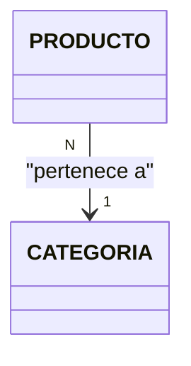

# Guía para la Creación del Diagrama de Clases UML (SCE2.2) 🧩

Esta guía explica paso a paso cómo construir el diagrama de clases de tu proyecto integrador para cumplir con los estándares de la rúbrica y obtener la nota máxima.

---

## 1. ¿Qué es un Diagrama de Clases UML?
Es una representación visual de la estructura del sistema, mostrando las **clases**, sus **atributos**, **métodos** y cómo se **relacionan** entre sí. Es el plano técnico de tu código Java.

---

## 2. Anatomía de una Clase en UML
Cada clase se representa como un rectángulo dividido en tres secciones:

1.  **Sección Superior:** Nombre de la clase (ej: `PRODUCTO`).
2.  **Sección Media:** Atributos (variables).
3.  **Sección Inferior:** Métodos (funciones).

### Visibilidad de Atributos y Métodos
Debes usar los símbolos correctos según el encapsulamiento en Java:
*   `-` **Privado:** Solo la propia clase lo ve (ej: `- precio : double`).
*   `+` **Público:** Cualquier clase lo ve (ej: `+ getPrecio() : double`).
*   `#` **Protegido:** Solo la clase y sus hijas lo ven.

---

## 3. Tipos de Relaciones (Lo más importante para el 5.0)
Las flechas indican cómo interactúan las clases. En tu proyecto SIGEV-Volcano, usamos principalmente:

### A. Asociación (Flecha con punta abierta `-->`)
Indica una relación estructural donde una clase "conoce" a otra.
*   *Ejemplo:* Un `USUARIO` tiene un `ROL`. 
*   *En el diagrama:* `USUARIO "N" --> "1" ROL` (Muchos usuarios tienen un solo rol).

### B. Composición (Diamante relleno `◆--`)
Indica que una clase contiene a otra y su ciclo de vida depende de la principal.
*   *Ejemplo:* Una `VENTA` tiene un `DETALLE_VENTA`. Si borras la venta, los detalles no tienen sentido solos.

### C. Herencia (Flecha con punta de triángulo vacía `--|>`)
Indica que una clase hija hereda de una clase padre.
*   *Ejemplo:* Si tuvieras una clase `Persona` y `Cliente` hereda de ella.

---

## 4. Cómo Mapear tu Código Java al Diagrama
Para que el diagrama sea fiel a la realidad:

1.  **Mira tus Entidades (Carpeta `modelo`):**
    *   Toma los campos de la clase (ej: `private int stockActual`) y ponlos como atributos privados en UML.
    *   Toma los métodos lógicos (ej: `public boolean isStockBajo()`) y ponlos como métodos públicos.
2.  **Identifica las Llaves Foráneas (FK):**
    *   Si en la base de datos `Producto` tiene un `idCategoria`, en UML debe haber una flecha desde `PRODUCTO` hacia `CATEGORIA`.
3.  **Agrega la Multiplicidad:**
    *   `1`: Uno y solo uno.
    *   `0..*` o `N`: Muchos.
    *   *Ejemplo:* Un Producto pertenece a **1** Categoría, pero una Categoría puede tener **N** Productos.

---

## 5. Herramientas Recomendadas 🛠️
1.  **Draw.io (Diagrams.net):** Gratis y profesional. Usa las bibliotecas de "UML".
2.  **Mermaid.js:** (La que estás usando en el archivo HTML). Permite crear diagramas escribiendo texto/código. Es excelente para mantener el diagrama actualizado junto al código.
3.  **StarUML:** Herramienta especializada en UML (de pago, con versión evaluativa).

---

## 6. Checklist de Excelencia (Rúbrica SCE2.2) ✅
Para asegurar que tu diagrama sea calificado con la nota máxima:

- [ ] **Tipos de Datos:** ¿Todos los atributos tienen su tipo (int, String, double, Date)?
- [ ] **Visibilidad:** ¿Los atributos son mayormente privados `-` y los métodos públicos `+`?
- [ ] **Métodos Clave:** No solo pongas Getters y Setters; incluye lógica de negocio (ej: `calcularTotal()`, `autenticar()`).
- [ ] **Multiplicidad:** ¿Están los números "1" y "N" en las puntas de las relaciones?
- [ ] **Nombres:** Usa nombres claros y consistentes con tu base de datos y código Java.

---

## 7. Ejemplo de Sintaxis (Mermaid)
Si usas Mermaid, así se define una relación:

Esto dice: "Muchos (N) productos pertenecen a una (1) categoría".

**¡Con esta guía, tu diagrama de clases será el pilar técnico que el jurado espera ver!** 🚀🎯
